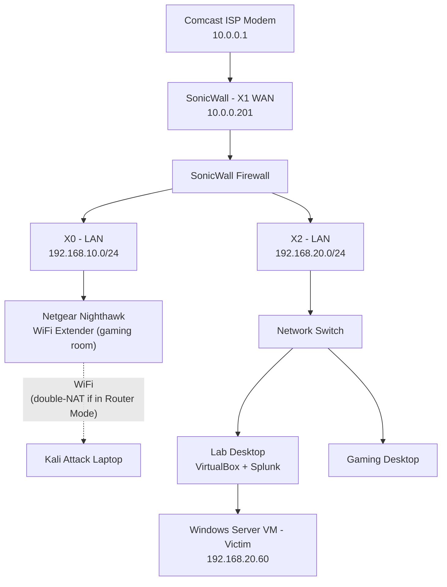

# Network Map

This renders automatically as a diagram on GitHub — no image file needed,
it's just text.

## Notes

- **X0** (`192.168.10.0/24`) and **X2** (`192.168.20.0/24`) are separate
  LAN zones on the SonicWall.
- The Nighthawk, when left in Router Mode, created a hidden third network
  and NAT'd Kali's real address — this is the double-NAT issue documented
  in the README's "What I've learned" section.
- The lab desktop hosts the Windows Server victim VM internally; Splunk
  runs directly on the desktop, not inside a VM.
